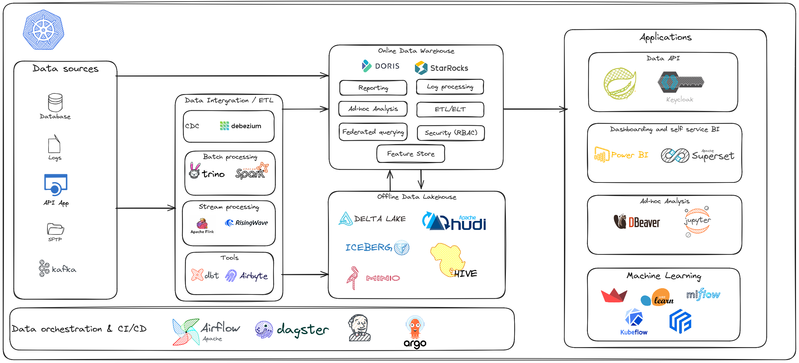

# Data Architecture

[Original src](https://github.com/viethqb/data-platform-notes)

 

# Technical Stack

|     Tools       | Distributions |                                        Descriptions                                        |   Status    |
|:--------------: | :-----------: | :----------------------------------------------------------------------------------------: | :---------: |
|   kubernetes    |               |                                  Container orchestration                                   |    Done     |
|                 |    kubeadm    |                                  Container orchestration                                   |    Done     |
|                 |      k0s      |                                  Container orchestration                                   |    Done     |
|                 |     rke2      |                                  Container orchestration                                   |    Done     |
|                 |      k3s      |                                  Container orchestration                                   |    Done     |
|     Minio       |               |   Secure object storage solution for reliable data storage in distributed environments.    |    Done     |
| Hive Metastore  |               |      Schema management tool ensuring seamless evolution and organization of data.          |    Done     |
|     Trino       |               |              High-performance query engine for distributed data processing.                |    Done     |
|     Spark       |               |                               Distributed processing engine                                |    Done     |
|     Doris       |               |                                  Real-time data warehouse                                  |    Done     |
|   StarRocks     |               |                                  Real-time data warehouse                                  | Not started |
|     Kafka       |               |                                 Stream-processing platform                                 |    Done     |
|     Flink       |               |             Robust stream processing framework for real-time data analytics.               |  In Process |
|   RisingWave    |               |                                     streaming database                                     | Not started |
|    Camel K      |               |                            Open Source integration framework                               | Not started |
|    Airflow      |               |                                Workflow management platform                                |    Done     |
|    Superset     |               |                          Data exploration and data visualization                           | Not started |
|Jupyter Notebook |               |        Web-based interactive development environment for notebooks, code, and data.        | Not started |
|     MLflow      |               |                   A platform to streamline machine learning development                    | Not started |
|   Streamlit     |               | Python framework for data scientists and AI/ML engineers to deliver interactive data apps. | Not started |
|  Spring Boot    |               |                      Web framework for building RESTful APIs in Java.                      | Not started |
|    FastAPI      |               |                 Modern web framework for building RESTful APIs in Python.                  | Not started |
|    Jenkins      |               |                                  Open-source CI/CD server                                  | Not started |
|    Argo CD      |               |         Argo CD is a declarative, GitOps continuous delivery tool for Kubernetes.          | Not started |

https://viet1846.medium.com/

 

### [Kubernetes Data Platform][Part 1]: Introduction

### [Kubernetes Data Platform][Part 2.1]: Highly available Kubernetes cluster with kubeadm

### [Kubernetes Data Platform][Part 2.2]: Creating highly available Kubernetes cluster with k0s

### [Kubernetes Data Platform][Part 2.3]: Creating highly available Kubernetes cluster with rke2

### [Kubernetes Data Platform][Part 2.4]: Creating highly available Kubernetes cluster with k3s

### [Kubernetes Data Platform][Part 3][Main Components]: Install Distributed MinIO Cluster

### [Kubernetes Data Platform][Part 4][Main Components]: Install Hive Metastore, Trino on Kubernetes

### [Kubernetes Data Platform][Part 5.1][Main Components]: Apache Spark with Kubernetes Spark Operator

### [Kubernetes Data Platform][Part 5.2][Main Components]: Apache Spark with Spark Connect Server

### [Kubernetes Data Platform][Part 6][Main Components]: Data Orchestrate with Apache Airflow

### [Kubernetes Data Platform][Part 7][Main Components]: Data warehouse with Apache Doris

### [Kubernetes Data Platform][Part 8][Main Components]: Data warehouse with StarRocks

### [Kubernetes Data Platform][Part 9][Real-time Components]: Apache Kafka, Kafka connect and Debezium
